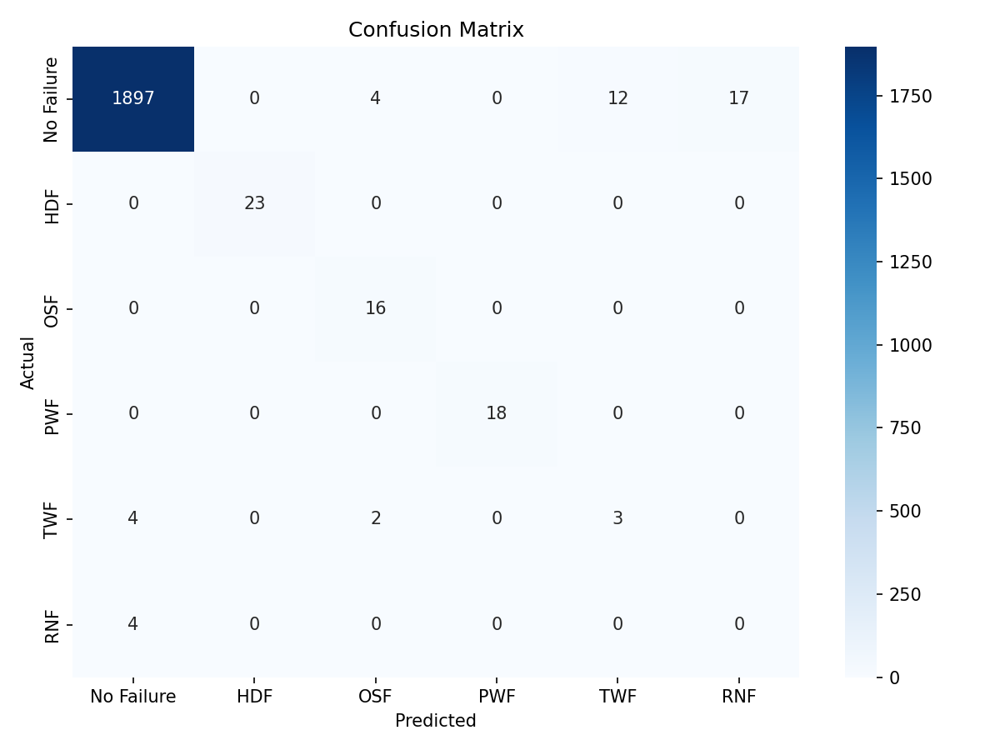

# Assignment Report

**Course:** Advanced Python (ICS0019)

**Team members:** Deran Eric Aalde, Katherin Reet Sisask

**Date:** 20.05.2026

**Repository link:** https://github.com/katherinsisask-ops/maritime-predictive-maintenance-ml

---

# 1. Approach

## 1.1 Strategy overview

We followed the same machine learning workflow as in the NIDS assignment, but applied it to the maritime predictive maintenance dataset. Our goal was to classify equipment sensor readings into normal operation or one of five fault types.

Before experimenting, our main strategy was to improve macro F1 score by handling the extreme class imbalance and by adding physically meaningful engineered features.

---

## 1.2 Preprocessing

### Feature engineering

We created four additional features:

- `temp_difference`
- `power`
- `wear_torque`
- `temp_ratio`

These features were chosen because they describe physical relationships related to heat dissipation, power output, overstrain, and relative heating.

### Feature selection

We did not apply a formal feature-selection algorithm. We removed only identifier and leakage columns:

- `UDI`
- `Product ID`
- `Machine failure`
- original binary failure columns

### Scaling

We did not apply StandardScaler or MinMaxScaler because Random Forest models do not require feature scaling.

### Other preprocessing

The categorical `Type` column was encoded using `LabelEncoder`.

The data was split using `train_test_split` with `stratify=y` to preserve rare classes in both train and test sets.

---

## 1.3 Class imbalance handling

### Method used

SMOTE combined with `class_weight='balanced'`.

### Parameters

- `SMOTE(random_state=42)`
- `RandomForestClassifier(n_estimators=200, random_state=42, class_weight='balanced')`

### Effect on training set distribution

SMOTE oversampled the minority classes in the training set so the model had more examples of rare fault types during training.

---

# 2. Experiments

The total number of experiments was 4.

## Experiment 1: Baseline Random Forest

- **Algorithm:** Random Forest
- **What changed from baseline:** Nothing. This was our first baseline run without SMOTE or engineered physical features.
- **Macro F1 (CV):** Not recorded
- **Macro F1 (test):** 0.5496
- **Observation:** Accuracy was high because most records were No Failure, but macro F1 was weaker because rare classes such as TWF and RNF were not detected.

---

## Experiment 2: Balanced Random Forest

- **Algorithm:** Random Forest
- **What changed:** Added `class_weight='balanced'`
- **Macro F1 (CV):** Not recorded
- **Macro F1 (test):** 0.5502
- **Observation:** Class weighting alone did not noticeably improve performance on the rarest classes.

---

## Experiment 3: SMOTE with engineered features

- **Algorithm:** Random Forest
- **What changed:** Added SMOTE, balanced class weights, and the engineered features `temp_difference`, `power`, and `wear_torque`
- **Macro F1 (CV):** 0.6289
- **Macro F1 (test):** 0.6741
- **Observation:** This gave a clear improvement in macro F1. HDF, PWF, and OSF detection improved strongly, while RNF remained undetected.

---

## Experiment 4: Final model with temperature ratio

- **Algorithm:** Random Forest
- **What changed:** Added the additional engineered feature `temp_ratio`
- **Macro F1 (CV):** 0.6357
- **Macro F1 (test):** 0.6802
- **Observation:** The final feature improved both cross-validation and test macro F1. TWF detection improved slightly, but RNF still remained at zero due to the very small number of examples.

---

## Experiments summary

| # | Description | Algorithm | Imbalance Handling | Macro F1 (CV) | Macro F1 (test) |
|---|---|---|---|---|---|
| 1 | Baseline Random Forest | Random Forest | None | Not recorded | 0.5496 |
| 2 | Balanced Random Forest | Random Forest | class_weight='balanced' | Not recorded | 0.5502 |
| 3 | SMOTE + engineered features | Random Forest | SMOTE + class_weight='balanced' | 0.6289 | 0.6741 |
| 4 | Final model with temp_ratio | Random Forest | SMOTE + class_weight='balanced' | 0.6357 | 0.6802 |

---

# 3. Final results

## 3.1 Best model

- **Algorithm:** Random Forest
- **Key parameters:** `n_estimators=200`, `random_state=42`, `class_weight='balanced'`
- **Imbalance handling:** SMOTE + balanced class weights
- **Feature engineering:** `temp_difference`, `power`, `wear_torque`, and `temp_ratio`

---

## 3.2 Final macro F1 score

| Metric | Score |
|---|---|
| Macro F1 (test) | 0.6802 |
| Macro F1 (CV) | 0.6357 |

---

## 3.3 Classification report

| Category | Precision | Recall | F1-Score | Support |
|---|---|---|---|---|
| HDF | 1.00 | 1.00 | 1.00 | 23 |
| No Failure | 1.00 | 0.98 | 0.99 | 1930 |
| OSF | 0.73 | 1.00 | 0.84 | 16 |
| PWF | 1.00 | 1.00 | 1.00 | 18 |
| RNF | 0.00 | 0.00 | 0.00 | 4 |
| TWF | 0.20 | 0.33 | 0.25 | 9 |

---

## 3.4 Confusion matrix

---

# 4. Cross validation vs. test score

- **CV macro F1:** 0.6357 ± 0.0044
- **Test macro F1:** 0.6802
- **Gap:** CV − test = -0.0445

### Analysis

The test score was slightly higher than the cross-validation score.

This does not indicate overfitting, because the model did not perform better in cross-validation than on the test set.

The result suggests that the final model generalized reasonably well.

However, the model still failed to detect RNF because there were very few RNF examples available. This makes RNF difficult to learn even with SMOTE.

---

# 5. What worked and what didn't

## What had the biggest positive impact?

The biggest improvement came from combining SMOTE with physically meaningful engineered features.

Macro F1 increased from approximately 0.55 to 0.68.

The `power` and `wear_torque` features were especially useful because PWF and OSF are related to physical power and load conditions.

---

## What surprisingly didn't help?

Using `class_weight='balanced'` alone did not significantly improve macro F1.

The model still failed to detect TWF and RNF well.

This showed that class weighting alone was not enough for such an imbalanced dataset.

---

## What would you try with more time?

With more time, we would try:

- XGBoost or LightGBM
- more detailed hyperparameter tuning
- separate binary models for the rarest classes

We would also investigate RNF separately because it may be too rare and random to classify reliably using the current dataset.

---

# Appendix 1. Environment

- **Hardware:** 2 laptops: Intel i7 laptop, 16 GB RAM and Intel i5 laptop, 16 GB RAM, integrated graphics
- **Python version:** Python 3.14
- **Key libraries:** pandas 3.0.3, numpy 2.4.5, scikit-learn 1.8.0, imbalanced-learn 0.14.1, matplotlib 3.10.9, seaborn 0.13.2, xgboost 3.2.0
- **Random seed:** 42